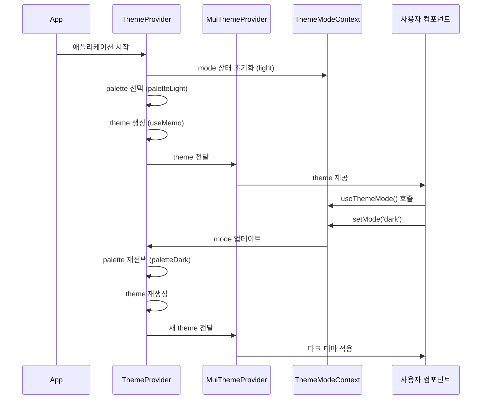
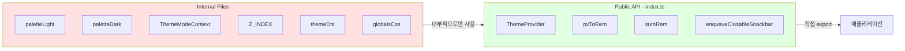

# Styles 폴더 가이드

이 문서는 `/src/styles` 폴더의 사용법과 내부 구조를 설명합니다. AI 에이전트와 개발자 모두를 위한 참고 자료입니다.

---

## 📖 목차

1. [외부 사용 시 (Public API)](#1-외부-사용-시-public-api)
2. [내부 수정 시 (Internal Architecture)](#2-내부-수정-시-internal-architecture)
3. [아키텍처 다이어그램](#3-아키텍처-다이어그램)
4. [수정 가이드라인](#4-수정-가이드라인)
5. [README 유지보수 규칙](#5-readme-유지보수-규칙)

---

## 1. 외부 사용 시 (Public API)

`index.ts`를 통해 export되는 항목들만 외부에서 사용해야 합니다.

### 1.1 ThemeProvider

애플리케이션의 최상위에서 Material-UI 테마와 스타일을 제공하는 컴포넌트입니다.

**사용 예시:**

```tsx
import { ThemeProvider } from '@/styles';

function App() {
  return (
    <ThemeProvider>
      <YourApp />
    </ThemeProvider>
  );
}
```

**제공하는 기능:**
- Material-UI 테마 (라이트/다크 모드 지원)
- CssBaseline 자동 적용
- Snackbar 프로바이더 (notistack)
- 글로벌 CSS 스타일 적용

**내부적으로 포함하는 것:**
- 커스텀 팔레트 (라이트/다크)
- 타이포그래피 설정 (Pretendard 폰트)
- MUI 컴포넌트 스타일 오버라이드
- 커스텀 테마 속성 (heights, shadows 등)

### 1.2 pxToRem()

픽셀 값을 rem 단위로 변환하는 유틸리티 함수입니다.

**시그니처:**

```typescript
pxToRem(px: number): string
```

**사용 예시:**

```tsx
import { pxToRem } from '@/styles';

const StyledDiv = styled('div')({
  padding: pxToRem(16),      // "1rem"
  marginTop: pxToRem(24),    // "1.5rem"
  fontSize: pxToRem(14),     // "0.875rem"
});
```

**파라미터:**
- `px` (number): 변환할 픽셀 값

**반환값:**
- `string`: rem 단위 문자열 (예: "1rem")

**주의사항:**
- 기본 폰트 크기는 16px입니다
- `--base-font-size` CSS 변수로 커스터마이징 가능

### 1.3 sumRem()

두 개의 rem 값을 더하는 유틸리티 함수입니다.

**시그니처:**

```typescript
sumRem(rem1: string, rem2: string): string
```

**사용 예시:**

```tsx
import { sumRem, pxToRem } from '@/styles';

const spacing1 = pxToRem(16);  // "1rem"
const spacing2 = pxToRem(8);   // "0.5rem"
const total = sumRem(spacing1, spacing2);  // "1.5rem"

const StyledDiv = styled('div')({
  padding: total,
});
```

**파라미터:**
- `rem1` (string): 첫 번째 rem 값
- `rem2` (string): 두 번째 rem 값

**반환값:**
- `string`: 합산된 rem 단위 문자열

### 1.4 enqueueClosableSnackbar()

닫기 버튼이 있는 스낵바를 생성하는 헬퍼 함수입니다.

**시그니처:**

```typescript
enqueueClosableSnackbar<V extends VariantType>(
  options: OptionsWithExtraProps<V> & { message?: SnackbarMessage }
): SnackbarKey
```

**사용 예시:**

```tsx
import { enqueueClosableSnackbar } from '@/styles';

// 기본 사용
enqueueClosableSnackbar({
  message: '저장되었습니다',
  variant: 'success',
});

// 옵션 커스터마이징
enqueueClosableSnackbar({
  message: '오류가 발생했습니다',
  variant: 'error',
  autoHideDuration: 5000,  // 5초 후 자동 닫기
});

// 스낵바 키를 저장하여 수동으로 닫기
const key = enqueueClosableSnackbar({
  message: '처리 중...',
  variant: 'info',
});
// 나중에: closeSnackbar(key)
```

**파라미터:**
- `options`: notistack의 옵션 객체
  - `message`: 표시할 메시지
  - `variant`: 스낵바 타입 ('default' | 'success' | 'error' | 'warning' | 'info')
  - `autoHideDuration`: 자동 닫기 시간 (기본값: 3000ms)
  - 기타 notistack 옵션들

**반환값:**
- `SnackbarKey`: 스낵바를 식별하는 키 (수동으로 닫을 때 사용)

**특징:**
- 자동으로 닫기 버튼(X) 추가
- 기본 자동 닫기 시간은 3초
- ThemeProvider 내에서만 사용 가능

### 1.5 useThemeMode() (간접 사용 가능)

테마 모드(라이트/다크)를 변경할 수 있는 훅입니다.

**주의:** `index.ts`에서 직접 export되지 않지만, `ThemeModeContext`를 통해 사용 가능합니다.

**사용 예시:**

```tsx
import { useThemeMode } from '@/styles/ThemeModeContext';

function ThemeToggle() {
  const { mode, setMode } = useThemeMode();

  const toggleTheme = () => {
    setMode(mode === 'light' ? 'dark' : 'light');
  };

  return (
    <Button onClick={toggleTheme}>
      {mode === 'light' ? '🌙 다크 모드' : '☀️ 라이트 모드'}
    </Button>
  );
}
```

**반환값:**
- `mode` (PaletteMode): 현재 테마 모드 ('light' | 'dark')
- `setMode` (function): 테마 모드를 변경하는 함수

---

## 2. 내부 수정 시 (Internal Architecture)

각 파일의 역할과 수정 시 주의사항을 설명합니다.

### 2.1 ThemeProvider.tsx

**역할:** MUI 테마 설정의 핵심 파일. 전체 애플리케이션의 디자인 시스템을 정의합니다.

**주요 구성 요소:**

#### 2.1.1 팔레트 (Palette)
```typescript
const paletteByMode: Record<PaletteMode, PaletteOptions> = {
  light: paletteLight,
  dark: paletteDark,
};
```
- `palette.light.ts`와 `palette.dark.ts`에서 색상 가져옴
- 모드에 따라 자동으로 팔레트 전환

#### 2.1.2 Shape
```typescript
shape: {
  borderRadius: pxToRem(8),
}
```
- 전역 border-radius 설정
- 모든 MUI 컴포넌트에 기본 적용

#### 2.1.3 Shadows
```typescript
shadows: [
  'none',
  '0 1px 2px 0 rgb(0 0 0 / 0.05)',
  // ... 24개의 shadow 레벨
]
```
- MUI의 shadows 배열 (25개 요소 필수)
- elevation prop에 따라 자동 적용

#### 2.1.4 커스텀 속성: heights
```typescript
heights: {
  sm: pxToRem(36),
  md: pxToRem(44),
  lg: pxToRem(52),
}
```
- 커스텀 높이 토큰
- `theme.d.ts`에 타입 정의됨
- 사용 예: `theme.heights.md`

#### 2.1.5 Typography
```typescript
typography: {
  fontFamily: ['Pretendard Variable', ...].join(','),
  h1: { fontSize: pxToRem(48), fontWeight: 700, ... },
  h2: { fontSize: pxToRem(36), fontWeight: 700, ... },
  // ...
  body1: { fontSize: pxToRem(14), ... },
  body2: { fontSize: pxToRem(13), ... },
}
```
- Pretendard 폰트 사용
- h1~h6, body1~body2 등 타이포그래피 variant 정의
- 모든 크기는 `pxToRem()` 사용

#### 2.1.6 컴포넌트 스타일 오버라이드
```typescript
components: {
  MuiButton: { ... },
  MuiCard: { ... },
  MuiPaper: { ... },
  MuiTextField: { ... },
  // ... 더 많은 컴포넌트들
}
```
- 각 MUI 컴포넌트의 기본 스타일 커스터마이징
- `defaultProps`: 기본 props 설정
- `styleOverrides`: CSS 스타일 오버라이드

**수정 시 주의사항:**
- 새로운 MUI 컴포넌트 스타일을 추가할 때는 `components` 객체에 추가
- 색상 변경 시 `baseTheme.palette`를 사용하여 테마 색상 참조
- 모든 크기 값은 `pxToRem()` 함수 사용
- `useMemo`로 감싸져 있어 `mode` 변경 시에만 재생성

### 2.2 palette.light.ts / palette.dark.ts

**역할:** 라이트 모드와 다크 모드의 색상 팔레트를 정의합니다.

**구조:**

```typescript
export const paletteLight: PaletteOptions = {
  mode: 'light',
  primary: { main: '#18181b', light: '#3f3f46', dark: '#09090b', ... },
  secondary: { main: '#71717a', ... },
  error: { main: '#ef4444', ... },
  warning: { main: '#f59e0b', ... },
  info: { main: '#3b82f6', ... },
  success: { main: '#22c55e', ... },
  background: { default: '#fafafa', paper: '#ffffff' },
  text: { primary: '#09090b', secondary: '#71717a', disabled: '#a1a1aa' },
  divider: '#e4e4e7',
  action: { active, hover, selected, disabled, disabledBackground, focus },
};
```

**수정 시 주의사항:**
- **중요:** 색상을 변경할 때는 `palette.light.ts`와 `palette.dark.ts` 모두 확인 필요
- 두 팔레트는 대응되는 색상 구조를 가져야 함
- 각 색상은 `main`, `light`, `dark`, `contrastText` 포함
- `contrastText`는 해당 색상 위에 표시될 텍스트 색상
- 색상 코드는 Tailwind CSS의 zinc 팔레트 기반

### 2.3 css.utils.ts

**역할:** CSS 관련 유틸리티 함수를 제공합니다.

**함수:**

#### sumRem(rem1, rem2)
```typescript
export const sumRem = (rem1: string, rem2: string) => 
  `${parseFloat(rem1) + parseFloat(rem2)}rem`;
```
- 두 rem 값을 더함
- 문자열 파싱 후 계산

#### pxToRem(px)
```typescript
const getBaseFontSize = () => {
  const computedSize = parseInt(
    window.getComputedStyle(document.documentElement)
      .getPropertyValue('--base-font-size')
  );
  return computedSize || DEFAULT_BASE_FONT_SIZE;
};

export const pxToRem = (px: number) => {
  return `${px / baseFontSize}rem`;
};
```
- 픽셀을 rem으로 변환
- 기본 폰트 크기는 16px
- CSS 변수 `--base-font-size`로 커스터마이징 가능

**수정 시 주의사항:**
- 새로운 CSS 유틸리티 함수는 이 파일에 추가
- 추가한 함수는 `index.ts`에서 export 필요
- 기본 폰트 크기 변경 시 전체 레이아웃에 영향

### 2.4 snackbar.utils.tsx

**역할:** notistack 라이브러리를 래핑한 스낵바 유틸리티를 제공합니다.

**함수:**

```typescript
export const enqueueClosableSnackbar = <V extends VariantType>(
  options: OptionsWithExtraProps<V> & { message?: SnackbarMessage },
): SnackbarKey => {
  const { autoHideDuration = TIME_UNIT.unitOfMs.asSecond * 3 } = options;

  const snackbarKey = enqueueSnackbar({
    ...(options as object),
    autoHideDuration,
    action: <Close sx={{ cursor: 'pointer' }} onClick={() => closeSnackbar(snackbarKey)} />,
  });

  return snackbarKey;
};
```

**특징:**
- 자동으로 닫기 버튼 추가
- 기본 자동 닫기 시간: 3초
- `TIME_UNIT` 라이브러리 사용 (`@/lib`)

**수정 시 주의사항:**
- 스낵바 관련 헬퍼 함수는 이 파일에 추가
- 추가한 함수는 `index.ts`에서 export
- 닫기 아이콘 커스터마이징 가능

### 2.5 ThemeModeContext.ts

**역할:** 테마 모드(라이트/다크) 상태를 관리하는 Context를 제공합니다.

**구조:**

```typescript
export const ThemeModeContext = createContext<{
  mode: PaletteMode;
  setMode: (mode: PaletteMode) => void;
}>({
  mode: 'light',
  setMode: () => {},
});

export const useThemeMode = () => {
  const { mode, setMode } = useContext(ThemeModeContext);
  return { mode, setMode };
};
```

**사용 위치:**
- `ThemeProvider.tsx`에서 Provider로 감싸짐
- 컴포넌트에서 `useThemeMode()` 훅으로 사용

**수정 시 주의사항:**
- 테마 모드 관련 로직만 포함
- localStorage 연동 등 추가 기능은 여기서 구현 가능
- Provider는 `ThemeProvider.tsx`에 있음

### 2.6 theme.d.ts

**역할:** MUI Theme 타입을 확장하여 커스텀 속성을 추가합니다.

**내용:**

```typescript
declare module '@mui/material/styles' {
  interface Theme {
    heights: {
      sm: string;
      md: string;
      lg: string;
    };
  }
  interface ThemeOptions {
    heights?: {
      sm: string;
      md: string;
      lg: string;
    };
  }
}
```

**수정 시 주의사항:**
- 새로운 커스텀 테마 속성 추가 시 여기서 타입 정의
- `Theme`과 `ThemeOptions` 모두에 추가 필요
- `ThemeProvider.tsx`에서 실제 값 정의

**예시 - 새로운 속성 추가:**

```typescript
// 1. theme.d.ts에 타입 추가
interface Theme {
  heights: { ... };
  customSpacing: {  // 새로운 속성
    xs: string;
    sm: string;
  };
}

// 2. ThemeProvider.tsx에서 값 정의
createTheme({
  // ...
  customSpacing: {
    xs: pxToRem(4),
    sm: pxToRem(8),
  },
});
```

### 2.7 zIndex.constants.ts

**역할:** z-index 값을 상수로 관리하여 레이어 순서를 일관되게 유지합니다.

**내용:**

```typescript
export const Z_INDEX = {
  backward: 1000,
};
```

**수정 시 주의사항:**
- 새로운 레이어가 필요할 때 여기에 추가
- 값의 범위를 고려하여 추가 (예: 100 단위로 증가)
- 네이밍은 의미를 명확히 표현

**권장 네이밍 예시:**
```typescript
export const Z_INDEX = {
  backward: 1000,
  dropdown: 1100,
  modal: 1200,
  tooltip: 1300,
  notification: 1400,
};
```

### 2.8 globals.css

**역할:** 전역 CSS 스타일을 정의합니다.

**내용:**

```css
@import url('pretendard/dist/web/variable/pretendardvariable.css');

* {
  font-family: 'Pretendard Variable', Pretendard, -apple-system, BlinkMacSystemFont, system-ui, Roboto, sans-serif;
  white-space: pre-line;
}

a {
  color: inherit;
  text-decoration: none;
}
```

**특징:**
- Pretendard Variable 폰트 import
- 모든 요소에 폰트 패밀리 적용
- `white-space: pre-line`: 줄바꿈 문자 처리
- 링크 스타일 초기화

**수정 시 주의사항:**
- 전역 스타일만 정의 (컴포넌트 스타일은 ThemeProvider.tsx)
- 추가 폰트나 전역 CSS 변수는 여기에 정의
- 성능을 위해 최소한으로 유지

---

## 3. 아키텍처 다이어그램

### 3.1 파일 의존성 관계

```mermaid
graph TB
    index[index.ts<br/>Public API] --> ThemeProvider[ThemeProvider.tsx]
    index --> cssUtils[css.utils.ts]
    index --> snackbarUtils[snackbar.utils.tsx]
    
    ThemeProvider --> paletteLight[palette.light.ts]
    ThemeProvider --> paletteDark[palette.dark.ts]
    ThemeProvider --> cssUtils
    ThemeProvider --> ThemeModeContext[ThemeModeContext.ts]
    ThemeProvider --> globalsCss[globals.css]
    ThemeProvider --> themeDts[theme.d.ts]
    
    snackbarUtils --> libTime[@/lib/time]
    
    globalsCss --> pretendardFont[pretendard 폰트]
    
    style index fill:#e1f5ff
    style ThemeProvider fill:#fff4e1
    style cssUtils fill:#f0f0f0
    style snackbarUtils fill:#f0f0f0
```

### 3.2 데이터 흐름



### 3.3 Export 구조



---

## 4. 수정 가이드라인

### 4.1 새로운 MUI 컴포넌트 스타일 추가

**절차:**

1. `ThemeProvider.tsx`의 `components` 객체에 추가
2. MUI 컴포넌트 이름 확인 (예: `MuiButton`, `MuiCard`)
3. `defaultProps`와 `styleOverrides` 정의

**예시:**

```typescript
// ThemeProvider.tsx
components: {
  // ... 기존 컴포넌트들
  MuiAvatar: {
    defaultProps: {
      variant: 'circular',
    },
    styleOverrides: {
      root: {
        width: pxToRem(40),
        height: pxToRem(40),
        fontSize: pxToRem(16),
        fontWeight: 500,
      },
      rounded: {
        borderRadius: 8,
      },
    },
  },
}
```

**주의사항:**
- 크기 값은 `pxToRem()` 사용
- 색상은 `baseTheme.palette` 참조
- 기존 컴포넌트 스타일과 일관성 유지

### 4.2 테마 토큰 추가/변경

#### 4.2.1 색상 변경

**파일:** `palette.light.ts`, `palette.dark.ts`

```typescript
// palette.light.ts
export const paletteLight: PaletteOptions = {
  // ...
  primary: {
    main: '#새로운색상',
    light: '#밝은버전',
    dark: '#어두운버전',
    contrastText: '#텍스트색상',
  },
};

// palette.dark.ts - 동일한 구조로 다크 모드 색상 정의
```

**체크리스트:**
- [ ] `palette.light.ts` 수정
- [ ] `palette.dark.ts`도 함께 수정
- [ ] 브라우저에서 라이트/다크 모드 모두 테스트

#### 4.2.2 커스텀 테마 속성 추가

**1단계 - 타입 정의 (`theme.d.ts`):**

```typescript
declare module '@mui/material/styles' {
  interface Theme {
    customProperty: {
      value1: string;
      value2: string;
    };
  }
  interface ThemeOptions {
    customProperty?: {
      value1: string;
      value2: string;
    };
  }
}
```

**2단계 - 값 정의 (`ThemeProvider.tsx`):**

```typescript
createTheme({
  // ...
  customProperty: {
    value1: pxToRem(10),
    value2: pxToRem(20),
  },
});
```

**3단계 - 사용:**

```typescript
const Component = styled('div')(({ theme }) => ({
  padding: theme.customProperty.value1,
}));
```

### 4.3 새로운 유틸리티 함수 추가

**절차:**

1. 함수가 CSS 관련이면 `css.utils.ts`에 추가
2. 스낵바 관련이면 `snackbar.utils.tsx`에 추가
3. 새로운 카테고리면 새 파일 생성
4. `index.ts`에서 export

**예시 - CSS 유틸리티 추가:**

```typescript
// css.utils.ts
export const remToPx = (rem: string): number => {
  const baseFontSize = getBaseFontSize();
  return parseFloat(rem) * baseFontSize;
};

// index.ts
export * from './css.utils';  // remToPx도 자동으로 export됨
```

**예시 - 새로운 카테고리:**

```typescript
// animation.utils.ts
export const fadeIn = keyframes`
  from { opacity: 0; }
  to { opacity: 1; }
`;

// index.ts
export * from './animation.utils';
```

### 4.4 Export 규칙

**원칙:**

1. **공개 API만 `index.ts`에서 export**
   - 외부에서 사용할 함수/컴포넌트만 노출
   - 내부 구현 세부사항은 export하지 않음

2. **Named export 사용**
   ```typescript
   // Good
   export { default as ThemeProvider } from './ThemeProvider';
   export * from './css.utils';
   
   // Avoid
   export { default } from './ThemeProvider';
   ```

3. **타입도 함께 export**
   ```typescript
   export type { CustomType } from './custom';
   ```

**현재 export 항목:**
```typescript
// index.ts
export * from './css.utils';              // pxToRem, sumRem
export * from './snackbar.utils';         // enqueueClosableSnackbar
export { default as ThemeProvider } from './ThemeProvider';
```

**Export하지 않는 항목 (내부 전용):**
- `palette.light.ts` / `palette.dark.ts`
- `ThemeModeContext.ts` (사용자가 직접 import 가능)
- `theme.d.ts`
- `zIndex.constants.ts`
- `globals.css`

---

## 5. README 유지보수 규칙

**중요:** 코드를 수정할 때 이 README도 함께 업데이트해야 합니다.

### 5.1 README 업데이트가 필요한 경우

#### ✅ 필수 업데이트 상황

| 변경 사항 | 업데이트할 섹션 | 예시 |
|----------|----------------|------|
| `index.ts`에 새 export 추가 | [1. 외부 사용 시](#1-외부-사용-시-public-api) | 새 유틸리티 함수 추가 시 |
| 기존 export 함수 시그니처 변경 | [1. 외부 사용 시](#1-외부-사용-시-public-api) - 해당 함수 섹션 | `pxToRem` 파라미터 추가 시 |
| 새 파일 추가 | [2. 내부 수정 시](#2-내부-수정-시-internal-architecture), [3. 아키텍처 다이어그램](#3-아키텍처-다이어그램) | `animation.utils.ts` 추가 시 |
| 파일 삭제 | [2. 내부 수정 시](#2-내부-수정-시-internal-architecture), [3. 아키텍처 다이어그램](#3-아키텍처-다이어그램) | 더 이상 사용하지 않는 파일 제거 시 |
| `ThemeProvider` 주요 기능 변경 | [1.1 ThemeProvider](#11-themeprovider), [2.1 ThemeProvider.tsx](#21-themeprovidertsx) | 새로운 컴포넌트 오버라이드 추가 시 |
| 새로운 커스텀 테마 속성 추가 | [2.6 theme.d.ts](#26-themedts), [4.2.2](#422-커스텀-테마-속성-추가) | `heights` 외에 `widths` 추가 시 |

#### 📝 권장 업데이트 상황

| 변경 사항 | 업데이트할 섹션 | 예시 |
|----------|----------------|------|
| 컴포넌트 스타일 오버라이드 추가 | [4.1](#41-새로운-mui-컴포넌트-스타일-추가) 예시 업데이트 | 자주 사용하는 패턴 추가 시 |
| 색상 팔레트 대대적 변경 | [2.2](#22-palettelightts--palettedarkts), 예시 코드 | 디자인 시스템 변경 시 |
| 새로운 best practice 발견 | [4. 수정 가이드라인](#4-수정-가이드라인) | 개발 중 발견한 팁 추가 |

### 5.2 AI 에이전트를 위한 체크리스트

코드 수정 후 다음을 확인하세요:

```markdown
- [ ] `index.ts`를 수정했나요?
  - [ ] 새 export 추가 → 섹션 1에 사용법 추가
  - [ ] export 제거 → 섹션 1에서 해당 내용 제거
  - [ ] export 변경 → 섹션 1의 예시 코드 업데이트

- [ ] 새 파일을 추가했나요?
  - [ ] 섹션 2에 파일 설명 추가
  - [ ] 섹션 3의 아키텍처 다이어그램에 노드 추가
  - [ ] 섹션 4의 가이드라인에 해당 파일 사용법 추가

- [ ] 파일을 삭제했나요?
  - [ ] 섹션 2에서 해당 파일 설명 제거
  - [ ] 섹션 3의 다이어그램에서 노드 제거
  - [ ] 섹션 4에서 관련 가이드 제거

- [ ] 함수 시그니처를 변경했나요?
  - [ ] 섹션 1의 해당 함수 문서 업데이트
  - [ ] 예시 코드 실행 가능한지 확인

- [ ] `ThemeProvider.tsx`를 대폭 수정했나요?
  - [ ] 섹션 2.1의 설명 검토
  - [ ] 새로운 컴포넌트 오버라이드 추가 시 목록에 추가

- [ ] 테마 구조를 변경했나요?
  - [ ] 커스텀 속성 추가 → 섹션 2.6, 4.2.2 업데이트
  - [ ] 타이포그래피 변경 → 섹션 2.1.5 업데이트

- [ ] 주요 아키텍처를 변경했나요?
  - [ ] 섹션 3의 다이어그램 업데이트
  - [ ] 의존성 관계 재확인
```

### 5.3 개발자를 위한 팁

**빠른 문서 업데이트 가이드:**

1. **작은 변경:** 해당 섹션만 수정
   ```
   예: pxToRem 함수 파라미터 추가
   → 섹션 1.2만 업데이트
   ```

2. **파일 추가/삭제:** 3개 섹션 수정
   ```
   예: animation.utils.ts 추가
   → 섹션 2 (설명 추가)
   → 섹션 3 (다이어그램 추가)
   → 섹션 4 (사용 가이드 추가)
   ```

3. **대규모 리팩토링:** 전체 검토
   ```
   전체 README를 처음부터 읽으며 업데이트 필요
   ```

**문서화 우선순위:**

1. 🔴 **높음:** Public API 변경 (섹션 1)
2. 🟡 **중간:** 내부 구조 변경 (섹션 2)
3. 🟢 **낮음:** 예시 코드 개선 (섹션 4)

### 5.4 README 업데이트 예시

#### 예시 1: 새로운 함수 추가

**코드 변경:**
```typescript
// css.utils.ts
export const clamp = (min: number, value: number, max: number) => 
  Math.min(Math.max(value, min), max);

// index.ts
export * from './css.utils';  // clamp도 자동 export됨
```

**README 업데이트:**
```markdown
### 1.6 clamp()  // 섹션 1에 추가

값을 최소값과 최대값 사이로 제한하는 유틸리티 함수입니다.

**시그니처:**
```typescript
clamp(min: number, value: number, max: number): number
```

**사용 예시:**
```typescript
import { clamp } from '@/styles';

const width = clamp(100, userInput, 500);  // 100~500 사이 값
```
```

#### 예시 2: 파일 삭제

**코드 변경:**
```
zIndex.constants.ts 파일 삭제 (더 이상 사용 안 함)
```

**README 업데이트:**
```markdown
// 섹션 2.7 "zIndex.constants.ts" 전체 삭제
// 섹션 3.1 다이어그램에서 zIndex 노드 제거
```

---

## 📚 참고 자료

- [Material-UI 공식 문서](https://mui.com/material-ui/)
- [Material-UI 테마 커스터마이징](https://mui.com/material-ui/customization/theming/)
- [notistack 문서](https://notistack.com/)
- [Pretendard 폰트](https://github.com/orioncactus/pretendard)

---

**마지막 업데이트:** 2026-01-23
